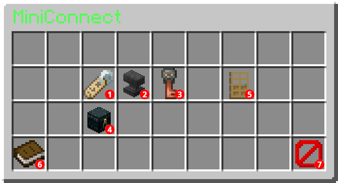

# MiniConnect
A miniature recreation of the old ViaProxyConnect server as a ViaProxy plugin.

## History
The original ViaProxyConnect was shut down after the public release of ViaProxy because of various reasons.\
ViaProxyConnect was based on BungeeCord reconnecting the player to the lobby or target server.
Hosting it required 3 servers (BungeeCord, Lobby Server, ViaProxy) running at the same time and linking them together.\
The original plugin used injection to modify the code of BungeeCord to make it work for this purpose.
This meant that the plugin needed to be updated for every new BungeeCord version.
On top of that it also added 1.7 support to BungeeCord which made it even more difficult to maintain.

This is a recreation of the most important features of ViaProxyConnect as a single plugin for ViaProxy.
It removes the need for multiple servers and automatically sets everything up for you.\
Since ViaProxy is now responsible for the connection handling and version translation, this plugin is much easier to maintain and should theoretically never break (unless ViaProxy changes something).

## Installation
Download the latest release from the [releases page](https://github.com/ViaVersionAddons/MiniConnect/releases) and put it into the `plugins` folder of your ViaProxy server.
> [!NOTE]
> After installing the plugin, ViaProxy will no longer function as a normal proxy server! The plugin will also change some config options of ViaProxy to make it work properly.\
> This can always be reverted by removing the plugin from the `plugins` folder and changing the config options back to their original values.

The plugin itself does not have any configuration options.

## Usage
After joining the server, a GUI with settings will open:\

1. **Set server address**: Enter the address of the server you want to connect to into the chat.
2. **Set protocol version**: Set the protocol version of the server you want to connect to.
3. **Login** (optional): Login with your Minecraft account to join premium servers.
4. **Proxy online mode**: Enable online mode for your account. This extra verification will be used to save settings between sessions.\
   After clicking the button, you have 60s to reconnect to the MiniConnect server with a valid Minecraft account.\
   You can disable this option at any time by clicking the button again.
5. **Connect to server**: Connect to the server after setting all options.
6. **How to use**: A small usage guide.
7. **Disconnect**: Disconnect from the lobby (same as closing the GUI).

> [!IMPORTANT]
> Enabling online mode also saves your logged in Minecraft account information (access token).\
> Your data will be encrypted, but make sure you trust the MiniConnect server you are enabling this option on.\
> Malicious servers can circumvent this encryption and access your data.

After setting all required option (server address and protocol version), click on the `Connect to server` button to connect to the server.\
Unless online mode is enabled, all settings will be lost on disconnect and you will have to set them again.

When connected to a server, you can return to the lobby by typing the `/disconnect` command in the chat.
This will retain all settings and you can immediately connect to another server.

### Wildcard Domain Support
If the MiniConnect server supports wildcard domains, you can use the ViaProxy wildcard syntax to pre-fill the server address and version.\
Examples:
- Format 1:\
  `address_port_version.viaproxy.hostname` e.g. `server.example.com_25565_1.8.viaproxy.example.com`
- Format 2:\
  `address.<address>.port.<port>.version.<version>.f2.viaproxy.hostname` e.g. `address.server.example.com.port.25565.version.1.8.f2.viaproxy.example.com`

Both fill `server.example.com:25565` as the server address and `1.8` as the protocol version.
